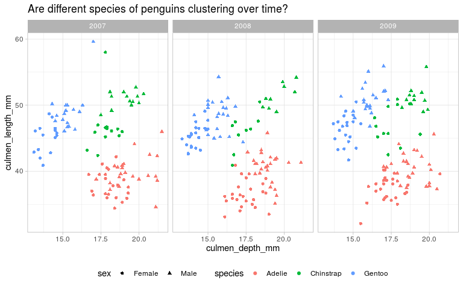
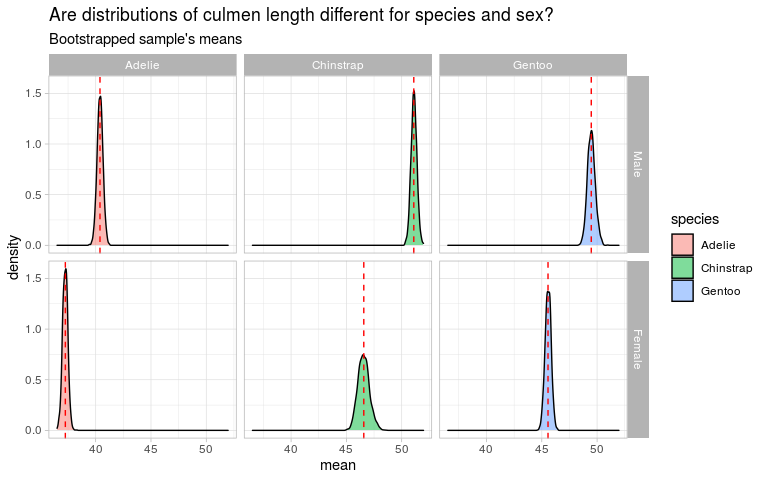
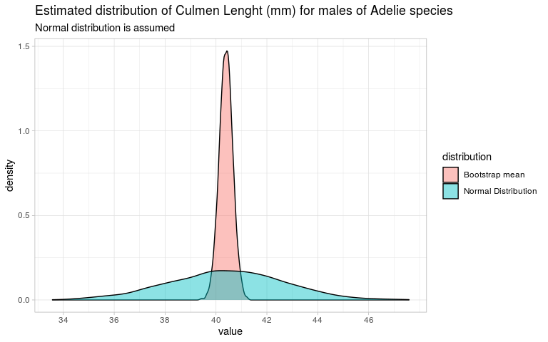
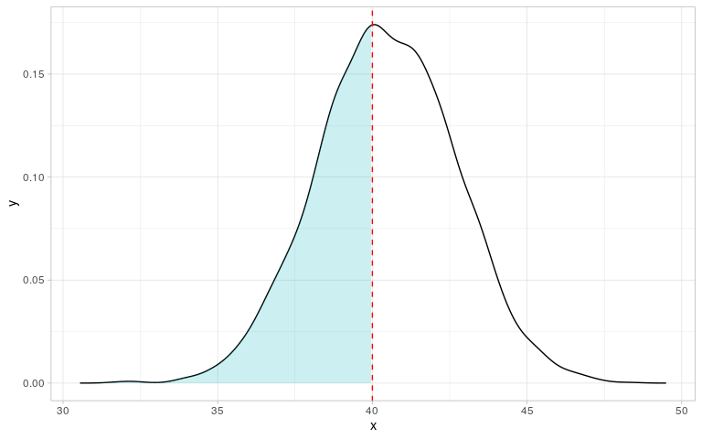
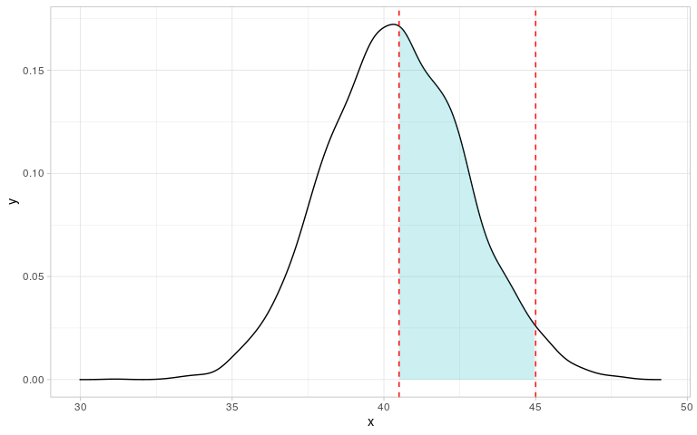

Palmer Penguins - Bootstraping
================
Petr Hrobař
2020-07-31

# Introduction

In this example we will use data from [tidytuesday
project](https://github.com/rfordatascience/tidytuesday). We will
perform basic sample bootstraping as well as logistic regression for
classification. Dataset is focusing on penguins and provides nice
dataset for analyses. Detailed descripton of each varaibles can be found
[here](https://allisonhorst.github.io/palmerpenguins/).

First, let’s do some basic data loading and cleaning:

``` r
# packages
library(tidyverse)
library(reshape2)
library(knitr)
library(kableExtra)

# Setting seed
set.seed(1)

theme_set(theme_light())


# Data loading and minor cleaning
penguins.csv <- 
  readr::read_csv('https://raw.githubusercontent.com/rfordatascience/tidytuesday/master/data/2020/2020-07-28/penguins_raw.csv') %>% 
  janitor::clean_names() %>% 
  mutate(species = 
           case_when(species == "Adelie Penguin (Pygoscelis adeliae)" ~ "Adelie",
                     species == "Gentoo penguin (Pygoscelis papua)" ~ "Gentoo", 
                     species == "Chinstrap penguin (Pygoscelis antarctica)" ~ "Chinstrap"),
         sex = as.factor(sex),
         species = as.factor(species)) %>% 
  separate(date_egg, c("year", "month", "day"), "-") %>% 
  select(-day) %>% 
  filter(!is.na(sex),
         !is.na(species))


levels(penguins.csv$sex) = c("Female", "Male")
```

Now let’s inspect how much are penguins relocating over time. We can
also notice visible custering tendencies within each species. This can
be pretty usefull for future analyses. Final cleaned dataset looks as
follows:

``` r
penguins.csv %>% 
  select(-study_name, -sample_number, -region, -island, -stage, -year, -month) %>% 
  head() %>% 
  knitr::kable()
```

<table>

<thead>

<tr>

<th style="text-align:left;">

species

</th>

<th style="text-align:left;">

individual\_id

</th>

<th style="text-align:left;">

clutch\_completion

</th>

<th style="text-align:right;">

culmen\_length\_mm

</th>

<th style="text-align:right;">

culmen\_depth\_mm

</th>

<th style="text-align:right;">

flipper\_length\_mm

</th>

<th style="text-align:right;">

body\_mass\_g

</th>

<th style="text-align:left;">

sex

</th>

<th style="text-align:right;">

delta\_15\_n\_o\_oo

</th>

<th style="text-align:right;">

delta\_13\_c\_o\_oo

</th>

<th style="text-align:left;">

comments

</th>

</tr>

</thead>

<tbody>

<tr>

<td style="text-align:left;">

Adelie

</td>

<td style="text-align:left;">

N1A1

</td>

<td style="text-align:left;">

Yes

</td>

<td style="text-align:right;">

39.1

</td>

<td style="text-align:right;">

18.7

</td>

<td style="text-align:right;">

181

</td>

<td style="text-align:right;">

3750

</td>

<td style="text-align:left;">

Male

</td>

<td style="text-align:right;">

NA

</td>

<td style="text-align:right;">

NA

</td>

<td style="text-align:left;">

Not enough blood for isotopes.

</td>

</tr>

<tr>

<td style="text-align:left;">

Adelie

</td>

<td style="text-align:left;">

N1A2

</td>

<td style="text-align:left;">

Yes

</td>

<td style="text-align:right;">

39.5

</td>

<td style="text-align:right;">

17.4

</td>

<td style="text-align:right;">

186

</td>

<td style="text-align:right;">

3800

</td>

<td style="text-align:left;">

Female

</td>

<td style="text-align:right;">

8.94956

</td>

<td style="text-align:right;">

\-24.69454

</td>

<td style="text-align:left;">

NA

</td>

</tr>

<tr>

<td style="text-align:left;">

Adelie

</td>

<td style="text-align:left;">

N2A1

</td>

<td style="text-align:left;">

Yes

</td>

<td style="text-align:right;">

40.3

</td>

<td style="text-align:right;">

18.0

</td>

<td style="text-align:right;">

195

</td>

<td style="text-align:right;">

3250

</td>

<td style="text-align:left;">

Female

</td>

<td style="text-align:right;">

8.36821

</td>

<td style="text-align:right;">

\-25.33302

</td>

<td style="text-align:left;">

NA

</td>

</tr>

<tr>

<td style="text-align:left;">

Adelie

</td>

<td style="text-align:left;">

N3A1

</td>

<td style="text-align:left;">

Yes

</td>

<td style="text-align:right;">

36.7

</td>

<td style="text-align:right;">

19.3

</td>

<td style="text-align:right;">

193

</td>

<td style="text-align:right;">

3450

</td>

<td style="text-align:left;">

Female

</td>

<td style="text-align:right;">

8.76651

</td>

<td style="text-align:right;">

\-25.32426

</td>

<td style="text-align:left;">

NA

</td>

</tr>

<tr>

<td style="text-align:left;">

Adelie

</td>

<td style="text-align:left;">

N3A2

</td>

<td style="text-align:left;">

Yes

</td>

<td style="text-align:right;">

39.3

</td>

<td style="text-align:right;">

20.6

</td>

<td style="text-align:right;">

190

</td>

<td style="text-align:right;">

3650

</td>

<td style="text-align:left;">

Male

</td>

<td style="text-align:right;">

8.66496

</td>

<td style="text-align:right;">

\-25.29805

</td>

<td style="text-align:left;">

NA

</td>

</tr>

<tr>

<td style="text-align:left;">

Adelie

</td>

<td style="text-align:left;">

N4A1

</td>

<td style="text-align:left;">

No

</td>

<td style="text-align:right;">

38.9

</td>

<td style="text-align:right;">

17.8

</td>

<td style="text-align:right;">

181

</td>

<td style="text-align:right;">

3625

</td>

<td style="text-align:left;">

Female

</td>

<td style="text-align:right;">

9.18718

</td>

<td style="text-align:right;">

\-25.21799

</td>

<td style="text-align:left;">

Nest never observed with full clutch.

</td>

</tr>

</tbody>

</table>

Before full analysis, we can inspect how each species tend to cluster
(over time).

``` r
# plot penguins spread over time - are they clustering (based on location)
penguins.csv %>% 
  ggplot(aes(culmen_length_mm, culmen_depth_mm, color = species, shape = sex)) +
  geom_point() + 
  coord_flip() + 
  theme(legend.position="bottom") + 
  labs(title = "Are different species of penguins clustering over time?") + 
  facet_wrap(~year)
```

<!-- -->

We have three species of penguins at our disposal,
i.e. . Also we are observing each
individuals sex. Therefore, we can take this factor into account as
well. Firstly, let’s inspect distributions of each obseeved metrics,
i.e. 

``` r
# Let's inspect distribution of four measures for each species (ignoring sex)
penguins.csv %>% 
  select(species, sex, 
         culmen_length_mm, 
         culmen_depth_mm, 
         flipper_length_mm, 
         body_mass_g) %>% 
  gather(key, value, -sex, -species) %>% 
  ggplot(aes(value)) + 
  geom_density(aes(fill = species), alpha = 0.4) + 
  facet_wrap(~key, scales = "free")
```

<!-- -->

# Bootstraping

Bootstrap is a powefull technique of obtaining (almost) any statistic
using random sampling methods. Main idea is that if our sample we are
working with is somewhat representative, we can bootstrap - sample with
replacement in order to obtain more precise characteristic of underlying
data-generating process distribution.

In this study, we will show to bootstrap methods can be used to obtain
more robust estimation of underlying distribution. More precisely,how to
obtain smaller standart error and perform statistical inference. Since
we have information about species as well as sex of particular penguin,
we shall nest data to account for variations not only among species but
also among sex within species.

``` r
grouped_boot <- 
  penguins.csv %>% 
  select(species, sex, 
         culmen_length_mm) %>% 
  group_by(species, sex) %>% 
  nest()


grouped_boot
```

    ## # A tibble: 6 x 3
    ## # Groups:   species, sex [6]
    ##   species   sex    data             
    ##   <fct>     <fct>  <list>           
    ## 1 Adelie    Male   <tibble [73 x 1]>
    ## 2 Adelie    Female <tibble [73 x 1]>
    ## 3 Gentoo    Female <tibble [58 x 1]>
    ## 4 Gentoo    Male   <tibble [61 x 1]>
    ## 5 Chinstrap Female <tibble [34 x 1]>
    ## 6 Chinstrap Male   <tibble [34 x 1]>

An example of nested dataset can be observed. We are in fact working
with not one big dataset but 6 smaller dataset at the same time.

Now let’s writte bootstrap function:

``` r
############################################################################## #
###########              Function for Performing BOOTSTRAP           ###########
############################################################################## #

# Function arguments:   df: dataframe to run bootstrap on,
#                       n: number of bootstrap replications to perform (default is 500)
#                       variable: metric to perform bootstrap on (default is culmen_length_mm)

boot_means <- function(df = df, n = 500, variable = "culmen_length_mm") {
  
  # create an empty dataframe for bootsraping results
  boot_means = tibble()
  
  # Iterate over random bootstrap samples
  for (i in 1:n) {
    message(i)
    mean_i <- 
      sample_n(df, size = nrow(df), replace = T) %>% 
      pull(variable) %>% mean()
    
    # Save the results to the dataframe
    boot_means = rbind(boot_means, mean_i)
    colnames(boot_means) = variable
  }
  return(boot_means)
}
```

Once the function is finished, we can illustrate power of the bootstrap.
We might be interested in distribution of  in Adelia species penguins population.
However, we only have random sample of Adelia males penguins population.
In order to generalize and understand real distribution we can perform
bootstrap. To demonstrate power of bootstraping, we show before and
after plots for comparison.

``` r
bootstrap_sample <- 
  penguins.csv %>% 
  filter(species == "Adelie",
         sex == "Male") %>% 
  select(culmen_length_mm) %>% 
  mutate(Type = "Before Bootstrap") %>% 
  bind_rows(penguins.csv %>% 
  filter(species == "Adelie",
         sex == "Male") %>% 
  boot_means(., n = 2000) %>% 
    mutate(Type = "After Bootstrap"))

bootstrap_sample$Type = factor(bootstrap_sample$Type, levels = c("Before Bootstrap", "After Bootstrap"))

bootstrap_sample %>% 
  ggplot(aes(culmen_length_mm)) + 
  geom_histogram(aes(fill = Type)) + 
  facet_wrap(~Type, scales = "free", ncol = 2) + 
  labs(title = "Distribution of culmen length for Adelia species - Males only", 
       subtitle = "Before and after bootstraping samples")
```

<!-- -->

As can be seen, bootstrap distribution seems to be somewhat normally
distributed. Now that we see power of bootstraping, let’s apply it to
every single metrix: , for
each single subgroup (sex within the species).

``` r
boot <- 
  grouped_boot %>% 
  ungroup() %>% 
  mutate(
    boot_charactersitic = map(data, ~boot_means(df = ., n = 2000))) %>% 
  unnest(boot_charactersitic) %>% 
  select(-data)


levels(boot$sex) = c("Female", "Male")
boot$sex = factor(boot$sex, levels = c("Male", "Female"))

boot %>%   
  #filter(sex == "MALE") %>% 
  ggplot(aes(culmen_length_mm)) + 
  geom_density(aes(fill = species), alpha = 0.5) + 
  facet_grid(~sex ~ species) + 
  labs(title = "Are distributions of culmen length different for species and sex?", subtitle = "Bootstrapped samples used")
```

<!-- -->

Using bootstraped distributions we can distinguish how are each metrics
(presumably) distributed in the population. Since all values seem to be
normaly distributed, parametrs of normal distribution can be used to
perform statistical inference.

Using , we can estimate parametrs of
a distribution of culmen lenghts (for perticular specie and sex).

``` r
# Maximum likelihood estimation of parametrs of normal dist. 
dist_arg <- 
  boot %>% 
  filter(sex == "Male", 
         species == "Adelie") %>% 
  pull(culmen_length_mm) %>% 
  MASS::fitdistr(., "normal") %>% 
  broom::tidy()

# Estimated parametrs
dist_arg %>% 
  knitr::kable()
```

<table>

<thead>

<tr>

<th style="text-align:left;">

term

</th>

<th style="text-align:right;">

estimate

</th>

<th style="text-align:right;">

std.error

</th>

</tr>

</thead>

<tbody>

<tr>

<td style="text-align:left;">

mean

</td>

<td style="text-align:right;">

40.3851425

</td>

<td style="text-align:right;">

0.0059731

</td>

</tr>

<tr>

<td style="text-align:left;">

sd

</td>

<td style="text-align:right;">

0.2671241

</td>

<td style="text-align:right;">

0.0042236

</td>

</tr>

</tbody>

</table>

``` r
boot %>% 
  filter(sex == "Male", 
         species == "Adelie") %>% 
  mutate(`Normal Distribution` = rnorm(2000, mean = dist_arg$estimate[1], sd = dist_arg$estimate[2])) %>% 
  gather(key, value, -species, -sex) %>% 
  mutate(key = ifelse(key == "culmen_length_mm", "Empirical Distribution", key)) %>% 
  ggplot(aes(value)) + 
  geom_density(aes(fill = key), alpha = 0.45) +
labs(title = "Estimated distribution of Culmen Lenght (mm) for males of Adelie species",
       subtitle = "Normal distribution is assumed",
         fill = "distribution") + 
  scale_x_continuous(breaks = c(seq(39, 44, by = 0.5)))
```

<!-- -->

It can be confirmed that normal distribution indeed seems to be a good
estimation. Now that we have paramets of distribution at our disposal,
basic statistical inference can be performed. For Example if we are
interested in probability that randomly picked male penguin from Adelie
specie has Culmen Lenght smaller or equal to some value, let’s say 40,
basic test can be used.

  
 = P(Z \\leq -1.45) = 0.074 ")  
, where  is Z-score of a
standart normal distribution. See below:

``` r
z <-  rnorm(1000,  mean = dist_arg$estimate[1], sd = dist_arg$estimate[2])

dens <- density(z)

data <- tibble(x = dens$x, y = dens$y) %>% 
    mutate(variable = case_when(
      (x <= 40) ~ "On",
      TRUE ~ NA_character_))

ggplot(data, aes(x, y)) + geom_line() +
  geom_area(data = filter(data, variable == 'On'), fill = '#00AFBB', alpha = 0.2) + 
  geom_vline(aes(xintercept = 40), lty = 2, color = "red")
```

<!-- -->

``` r
zz1 <- pnorm(40, mean = dist_arg$estimate[1], sd = dist_arg$estimate[2])
zz1
```

    ## [1] 0.07467783

Alternatively, we cancalculate what is a probability that randomly
picked male penguin from Adelie specie has Culmen Lenght between 40.5
and 41. Once again, quantiles of standart normal distribution can be
used

  
")  
:

``` r
z <-  rnorm(1000,  mean = dist_arg$estimate[1], sd = dist_arg$estimate[2])

dens <- density(z)

data <- tibble(x = dens$x, y = dens$y) %>% 
    mutate(variable = case_when(
      (x >= 40.5 & x <= 41) ~ "On",
      TRUE ~ NA_character_))

ggplot(data, aes(x, y)) + geom_line() +
  geom_area(data = filter(data, variable == 'On'), fill = '#00AFBB', alpha = 0.2) + 
  geom_vline(aes(xintercept = 40.5), lty = 2, color = "red") + 
  geom_vline(aes(xintercept = 41), lty = 2, color = "red")
```

<!-- -->

``` r
zz2 <- pnorm(41, mean = dist_arg$estimate[1], sd = dist_arg$estimate[2]) - 
  pnorm(40.5, mean = dist_arg$estimate[1], sd = dist_arg$estimate[2])

zz2
```

    ## [1] 0.3229316

Where area displayed above is equal to 0.3229. Using MLE estimation to
obtain parameters of normal distribution is one approach that can be
used. Alternatively, since we are working with bootstraped sample we can
estimate distribution’s mean and standart deviation as a
, e.i.  and  as .

``` r
conf_intervals_original_data <- 
  grouped_boot %>% 
  unnest() %>% 
  group_by(species, sex) %>% 
  summarise(mean = mean(culmen_length_mm),
            sd = sd(culmen_length_mm),
            count = n(), 
            sd = sd/(sqrt(count))) %>% 
  mutate(conf.low = mean - (qnorm(0.975) * sd),
         conf.high = mean + (qnorm(0.975) * sd))


conf_intervals_boot_data <- 
  boot %>% 
  group_by(species, sex) %>% 
  summarise(mean = mean(culmen_length_mm),
            sd = sd(culmen_length_mm),
            count = n(), 
            sd = sd/(sqrt(count))) %>% 
  mutate(conf.low = mean - (qnorm(0.975) * sd),
         conf.high = mean + (qnorm(0.975) * sd))

ci_merged <- 
  conf_intervals_original_data %>% 
  mutate(distribution = "Original Data") %>% 
  bind_rows(conf_intervals_boot_data %>% 
              mutate(distribution = "Bootstraped Sample estimation"))
  

# levels(as.factor(ci_merged$distribution))
# ci_merged$distribution = factor(ci_merged$distribution, levels = c("Original Data", "Bootstraped Sample estimation"))
# 
# ci_merged %>%
#   filter(sex == "Male") %>%
#   ggplot(aes(mean, species, color = species)) +
#   geom_point(size = 3) +
#   geom_errorbar(aes(xmin = conf.low, xmax = conf.high), size = 1) +
#   facet_wrap(~distribution, ncol = 1) +
#   geom_vline(aes(xintercept = mean, color = species), lty = 2, size = 1) +
#   labs(title = "Bootstraped ")
```

``` r
# Estimated parametrs
mle_vals <- 
  dist_arg %>% 
  select(-std.error) %>% 
  pivot_wider(names_from = term, values_from = estimate) %>% 
  mutate(distribution = "MLE - estimation")

boot_vals <- 
  ci_merged %>% 
   filter(sex == "Male", 
         species == "Adelie") %>% 
  ungroup() %>%
  select(mean, sd, distribution)

bind_rows(mle_vals, boot_vals) %>%
  mutate(conf.low = mean - (qnorm(0.975) * sd),
         conf.high = mean + (qnorm(0.975) * sd)) %>% 
  ggplot(aes(mean, distribution, color = distribution)) + 
  geom_point() +
  geom_errorbar(aes(xmin = conf.low, xmax = conf.high)) + 
  labs(title = "Estimations of normal distribution expected values", 
       subtitle = "Estimation of Man Adelei Culmen Lenght -  Bootsraped ")
```

<!-- -->
